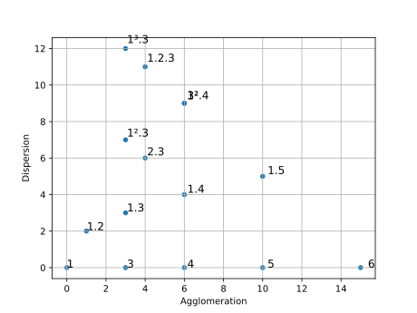
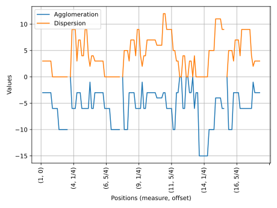
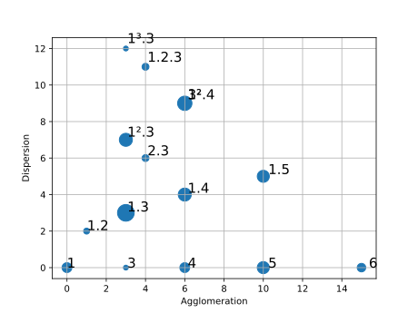
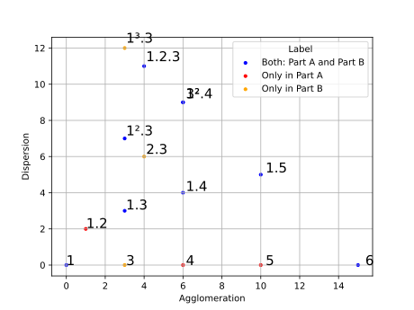
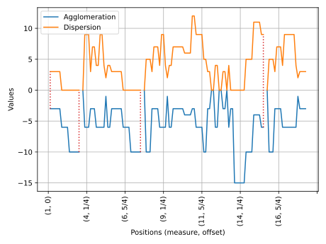
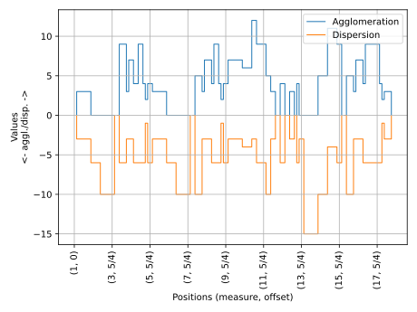
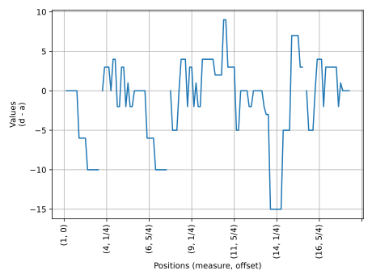

# Rhythmic Partitioning Scripts

This repository contains Rhythmic Partitioning Scripts (aka RP Scripts). This program is part of a paper written by [Marcos Sampaio](https://marcos.sampaio.me) and [Pauxy Gentil-Nunes](https://pauxy.net) and published at [Brazilian Journal of Music and Mathematics (MusMat)](https://musmat.org/wp-content/uploads/2022/12/02-Sampaio-Gentil-Nunes-V6N2_2022.pdf). The paper describes the RP Scripts' functionalities and operation.

RP Scripts are command-line Python scripts designed to extract rhythmic partitioning information from given digital music scores files, plot partitiogram and indexogram, and to create annotated digital music scores files.

RP Scripts reads MusicXML (compressed or not), Kern, and MIDI files and generates RP data in CSV files as well as partitioning charts.

## Install

RP Scripts are written in [Python 3](https://www.python.org/) and need some libraries listed in [requirements.txt](requirements.txt).

If you are not familiar with Python and its libraries, follow these steps:

1. Download and install Python 3 (check https://www.python.org/downloads/).
1. Download this repository.
1. Open a terminal (command prompt in Windows) and go to this repository's folder in your computer. For instance, `cd C:\Users\myName\rpScripts` (Windows) or `cd /Users/myName/rpScripts` (Mac).
1. Install the libraries with Python's `PIP` program: `pip install -r requirements.txt`

## Components and usage

RP Scripts comprises three standalone scripts:

- RPC: Rhythmic Partitioning Calculator
- RPP: Rhythmic Partitioning Plotter
- RPA: Rhythmic Partitioning Annotator
- RPL: Rhythmic Partitioning Labeller

These scripts are available at [src](src/README.md) folder.

Some examples of their usage are available at [examples](examples/README.md) folder.

### RPC

RPC processes the given digital score and returns a CSV file with partitions' information.

    python rpc.py score.xml

Since RPC uses Music21 library, it accepts MusicXML, MXL (compressed MusicXML), Kern and MIDI files as input.

CSV file output contains:

1. Index (`measure number + offset`)
1. Measure number
1. Offset
1. Global offset
1. Duration
1. Partition
1. Density number
1. Agglomeration index
1. Dispersion index

RPC returns a CSV file such as

```csv
"Index","Measure number","Offset","Global offset","Duration","Partition","Density-number","Agglomeration","Dispersion"
"1+0",1,0,0,1/4,"0",0,"",""
"1+1/4",1,1/4,1/4,3/2,"1.3",4,3.0,3.0
"1+1/2",1,1/2,1/2,3/2,"1.3",4,3.0,3.0
"2+0",2,0,3/4,3/2,"1.3",4,3.0,3.0
"2+1/4",2,1/4,1,3/2,"1.3",4,3.0,3.0
"2+1/2",2,1/2,5/4,3/2,"1.3",4,3.0,3.0
"2+3/4",2,3/4,3/2,3/2,"1.3",4,3.0,3.0
"2+1",2,1,7/4,1,"4",4,6.0,0.0
"2+5/4",2,5/4,2,1,"4",4,6.0,0.0
"2+3/2",2,3/2,9/4,1,"4",4,6.0,0.0
"2+7/4",2,7/4,5/2,1,"4",4,6.0,0.0
```

### RPP

RPP return partitiogram and indexogram from a given CSV file generated by RPC. The basic files are generated with:

    python rpp.py score.csv

Obs: All the examples below are related to Robert Schumann's op. 48, n. 2.



*Partitiogram*



*Indexogram*

RPP accepts multiple options to define image format, resolution, indexogram type, among other stuff.

#### Image format

Use `-f` option to set the chart images format. Otherwise, they RPP will generate them in svg format.

    python rpp.py -f svg score.csv
    python rpp.py -f png score.csv
    python rpp.py -f jpg score.csv

#### Image resolution

When an image format such as JPG or PNG is defined use `-r` to set its resolution:

    python rpp.py -f png -r 300 score.csv

#### Partitiogram options

##### Bubble partitiogram

Use `-u` to plot bubble partitiograms:

    python rpp.py -u score.csv



*Bubble partitiogram*

Use `--maximum_points_to_label` to set the maximum number of points to label in the bubble partitiogram chart. Default is 50:

    python rpp.py --maximum_points_to_label 20 -u score.csv

Use `--labels_size` to set labels' size in the bubble partitiogram chart. Default is 15:

    python rpp.py --labels_size 20 -u score.csv

Use `--labels_distance` to set the distance between points and labels in the bubble partitiogram chart. Default is 1.025:

    python rpp.py --labels_distance 2 -u score.csv

##### Comparative partitiograms

Use `-m` to plot comparative partitiograms. It demands an annotated CSV file with labels for each row. RPL script generates the annotated file (See section [RPL](#rpl)).

RPP generates comparative partitiograms for all labels combination pairs.

    python rpp.py -m score-labelled.csv



*Comparative partitiogram: parts A and B*

Use `--comparative_partitiogram_size` to define the dots size in comparative partitiogram. Default is 3, but in the previous example, the value is set to 10:

    python rpp.py --comparative_partitiogram_size 10 -m score-labelled.csv

#### Indexogram options

##### Closing bubbles

Use `-c` option to plot vertical lines closing indexogram bubbles:

    python rpp.py -c score.csv



*Indexogram with closing lines*

##### Stem style

Use `-e` to plot indexogram in stem style:

    python rpp.py -e score.csv


*Indexogram as stem chart*

##### Stairs style

Use `-t` to plot indexogram in stairs style:

    python rpp.py -t score.csv



*Indexogram as stair chart*

##### Combined style

Use `-b` to plot indexogram in combined style:

    python rpp.py -b score.csv



*Indexogram as combined chart*

##### All charts

Use `-a` to plot all available indexogram types charts:

    python rpp.py -a score.csv

### RPA

RPA generates annotated digital score from a given score and CSV file generated by RPC.

    python rpa.py -s score.xml -c score.csv


*Annotated score*

### RPL

RPL generates labelled CSV file form a given CSV file generated by RPC. One can add labels such as "Exposition", "First Theme", and so on. RPP needs labelled CSV to render comparative partitiograms.

RPL demands a TXT file with annotations with the label name and its start point, one in each line and separated by commas:

```txt
Introduction,1+0
Something important,2+1/4
The end,2+3/2
```

The labelled CSV looks like:

```csv
,Index,Measure number,Offset,Global offset,Duration,Partition,Density-number,Agglomeration,Dispersion,Label
0,1+0,1,0,0,1/4,0,0,,,Introduction
1,1+1/4,1,1/4,1/4,3/2,1.3,4,3.0,3.0,Introduction
2,1+1/2,1,1/2,1/2,3/2,1.3,4,3.0,3.0,Introduction
3,2+0,2,0,3/4,3/2,1.3,4,3.0,3.0,Introduction
4,2+1/4,2,1/4,1,3/2,1.3,4,3.0,3.0,Something important
5,2+1/2,2,1/2,5/4,3/2,1.3,4,3.0,3.0,Something important
6,2+3/4,2,3/4,3/2,3/2,1.3,4,3.0,3.0,Something important
7,2+1,2,1,7/4,1,4,4,6.0,0.0,Something important
8,2+5/4,2,5/4,2,1,4,4,6.0,0.0,Something important
9,2+3/2,2,3/2,9/4,1,4,4,6.0,0.0,The end
10,2+7/4,2,7/4,5/2,1,4,4,6.0,0.0,The end
```

## Bibliography

1. Gentil-Nunes, Pauxy. 2009. "Análise Particional: uma Mediação entre Composição Musical e a Teoria das Partições." Ph.D. Dissertation, Universidade Federal do Estado do Rio de Janeiro.
1. Sampaio, Marcos da Silva, and Pauxy Gentil-Nunes. 2022. "Python Scripts for Rhythmic Partitioning Analysis." *MusMat - Brazilian Journal of Music and Mathematics* 6 (2): 17-55. https://musmat.org/wp-content/uploads/2022/12/02-Sampaio-Gentil-Nunes-V6N2_2022.pdf.

## How to cite

Sampaio, Marcos da Silva and Pauxy Gentil-Nunes. RP Scripts: Rhythmic Partitioning Scripts, release 1.0. Available at https://github.com/msampaio/rpScripts. Accessed on Dec. 19, 2022, 2022.

[Bibtex](bibtex.bib)