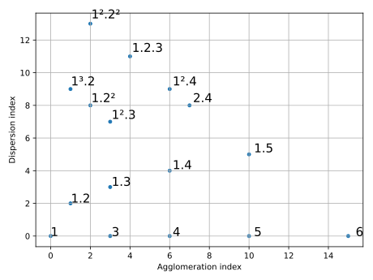
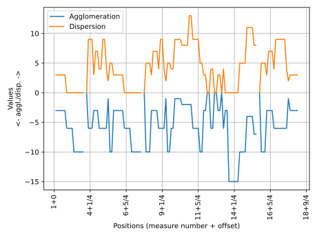

# Rhythmic Partitioning Scripts

RP Scripts is a command-line program designed to extract rhythmic partitioning information from given digital music scores files, plot partitiogram and indexogram, and to create annotated digital music scores files.

This program has been developed by [Marcos Sampaio](https://marcos.sampaio.me) with the assistance of [Pauxy Gentil-Nunes](https://pauxy.net). RP Scripts' features are described in some published papers (See the program's [Bibliography](https://rpscripts.readthedocs.io/en/latest/bibliography.html)).

See the program complete documentation at [https://rpscripts.readthedocs.io/](https://rpscripts.readthedocs.io/).

These following commands...

    rpscripts calc score.mxl
    rpscripts plot score.json

... plot the piece's partitiogram and indexogram charts:

... and the additional command...

    rpscripts annotate -s score.mxl score.json

... generates an annotated file score such as:

## How to cite

Sampaio, Marcos da Silva. RP Scripts: Rhythmic Partitioning Scripts, release 2. Available at https://github.com/msampaio/rpScripts. Accessed on Jan 3, 2025, 2025.

[Bibtex](bibtex.bib)