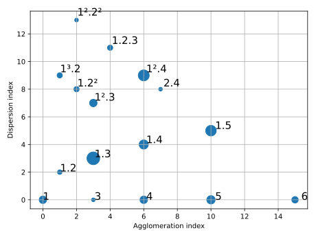
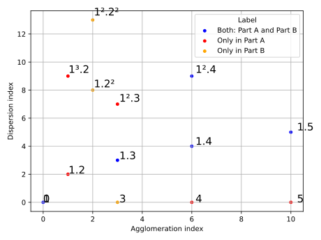

Plotter
=======

Plotter returns partitiogram and indexogram charts from a given JSON file generated by :doc:`calculator`. This command generates basic charts:

.. code-block:: console

    rpscripts plot score.json

**Note**: All the examples below are from Robert Schumann's op. 48, n. 2 (See the `examples <https://github.com/msampaio/rpScripts/tree/main/examples>`_ folder).

.. figure:: ../../../examples/schumann-opus48no2-simple-partitiogram.svg
    :alt: partitiogram

    Partitiogram

    Indexogram

Plotter accepts multiple options to define image format, resolution, and indexogram type.

The option ``-h`` prints the command help:

.. code-block:: console

    usage: rpscripts plot [-h] [-f IMG_FORMAT] [-r RESOLUTION] [-a] [-u] [-w] [-m]
                        [-fl] [-c] [-e] [-t] [-p] [-b]
                        [--minimum_dispersion MINIMUM_DISPERSION]
                        [--maximum_dispersion MAXIMUM_DISPERSION]
                        [--minimum_agglomeration MINIMUM_AGGLOMERATION]
                        [--maximum_agglomeration MAXIMUM_AGGLOMERATION]
                        [--maximum_points_to_label MAXIMUM_POINTS_TO_LABEL]
                        [--dots_size DOTS_SIZE] [--labels_size LABELS_SIZE]
                        [--labels_distance LABELS_DISTANCE]
                        [--indexogram_slope INDEXOGRAM_SLOPE]
                        [--figure_dimensions FIGURE_DIMENSIONS]
                        filename

    positional arguments:
    filename              JSON filename (calc's output)

    options:
    -h, --help            show this help message and exit
    -f IMG_FORMAT, --img_format IMG_FORMAT
                            Charts output format (svg, png, or jpg)
    -r RESOLUTION, --resolution RESOLUTION
                            PNG image resolution. Default=300
    -a, --all             Plot all available charts
    -u, --bubble_partitiogram
                            Partitiogram as a bubble chart
    -w, --without_labels  Partitiogram as a bubble chart without labels
    -m, --comparative_partitiogram
                            Comparative partitiogram. It demands a previous
                            labeled file. Check rpscripts labels -h' column
    -fl, --show_form_labels
                            Draw vertical lines to display given form labels. It
                            demands a previous labeled file. Check rpscripts
                            labels -h' column
    -c, --close_bubbles   Indexogram with bubbles' closing lines
    -e, --stem            Indexogram as a stem chart
    -t, --stairs          Indexogram as a stair chart
    -p, --step            Indexogram as a step chart
    -b, --combined        Indexogram as a combination of aglomeration and
                            dispersion
    --minimum_dispersion MINIMUM_DISPERSION
                            Partitiogram minimum dispersion value to render
    --maximum_dispersion MAXIMUM_DISPERSION
                            Partitiogram maximum dispersion value to render
    --minimum_agglomeration MINIMUM_AGGLOMERATION
                            Partitiogram minimum agglomeration value to render
    --maximum_agglomeration MAXIMUM_AGGLOMERATION
                            Partitiogram maximum agglomeration value to render
    --maximum_points_to_label MAXIMUM_POINTS_TO_LABEL
                            Maximum number of points to label in bubble
                            partitiogram chart. Default=50
    --dots_size DOTS_SIZE
                            Dots size in simple partitiogram chart. Default=15
    --labels_size LABELS_SIZE
                            Labels size in partitiogram chart. Default=15
    --labels_distance LABELS_DISTANCE
                            Distance between points and labels in partitiogram
                            chart. Default=1.025
    --indexogram_slope INDEXOGRAM_SLOPE
                            Slope's X-distance. Default=1/4 (use always rational
                            numbers)
    --figure_dimensions FIGURE_DIMENSIONS
                            Figure dimensions. Default=6.4,4.8 (comma separated
                            values)

Image format
------------

Use the ``-f`` option to set the chart images format. Otherwise, Plotter generates them in svg format.

.. code-block:: console

    rpscripts plot -f svg score.json
    rpscripts plot -f png score.json
    rpscripts plot -f jpg score.json

Image resolution
----------------

Use the ``-r`` option to set JPG or PNG image resolution.

.. code-block:: console

    rpscripts plot -f png -r 300 score.json

Image dimensions
----------------

Use the ``--figure_dimensions`` option to set the image dimensions:

.. code-block:: console

    rpscripts plot --figure_dimensions 16.0,4.8 score.json

Partitiogram options
---------------------

Use the ``--maximum_points_to_label`` option to set the maximum number of points to label in the partitiogram charts. The default value is 50:

.. code-block:: console

    rpscripts plot --maximum_points_to_label 20 -u score.json

Use the ``--labels_size`` option to set labels' size in the partitiogram charts. Default is 15:

.. code-block:: console

    rpscripts plot --labels_size 20 -u score.json

Use the ``--labels_distance`` option to set the distance between points and labels in the partitiogram charts. The default value is 1.025:

.. code-block:: console

    rpscripts plot --labels_distance 2 -u score.json

Use the ``--dots_size`` option to define the size of the dots in the partitiograms charts. The default value is 15 (the previous example's value is 10):

.. code-block:: console

    rpscripts plot --dots_size 10 -m score.json

Bubble partitiogram
^^^^^^^^^^^^^^^^^^^

Use the ``-u`` option to plot bubble partitiograms:

.. code-block:: console

    rpscripts plot -u score.json

    Bubble partitiogram

.. _comparative_partitiograms:

Comparative partitiograms
^^^^^^^^^^^^^^^^^^^^^^^^^

Use the ``-m`` option to plot comparative partitiograms. It demands a labeled ``JSON`` file. The :doc:`labeler` program generates the labeled file.

Plotter generates comparative partitiograms for the combination of pairs of all available labels.

.. code-block:: console

    rpscripts plot -m score.json

    Comparative partitiogram: parts A and B

Filters
^^^^^^^

Use the ``--minimum_dispersion``, ``--maximum_dispersion``, ``--minimum_agglomeration``, and ``--maximum_agglomeration`` options to filter the plotted partitiogram data.

.. code-block:: console

    rpscripts plot --minimum_dispersion 6 --maximum_agglomeration 8 score.json

    Filtered partitiogram

Indexogram options
------------------

Stem style
^^^^^^^^^^

Use the ``-e`` option to plot indexogram in stem style:

.. code-block:: console

    rpscripts plot -e score.json

    Indexogram as stem chart

.. _step_style:

Step style
^^^^^^^^^^

Use the ``-p`` option to plot indexogram in stem style:

.. code-block:: console

    rpscripts plot -e score.json

    Indexogram as step chart

.. _stairs_style:

Stairs style
^^^^^^^^^^^^

Use the ``-t`` option to plot indexogram in stairs style:

.. code-block:: console

    rpscripts plot -t score.json

    Indexogram as stair chart

Combined style
^^^^^^^^^^^^^^

Use the ``-b`` option to plot indexogram in combined style:

.. code-block:: console

    rpscripts plot -b score.json

    Indexogram as combined chart

Closing bubbles
^^^^^^^^^^^^^^^

For the Simple indexogram, use the ``-c`` option to plot vertical lines closing indexogram bubbles:

.. code-block:: console

    rpscripts plot -c score.json

    Indexogram with closing lines

.. _form_displaying:

Form labels displaying
^^^^^^^^^^^^^^^^^^^^^^

For the labels displaying, use the ``-fl`` option. It adds vertical lines in the indexogram. It demands a labeled ``JSON`` file. The :doc:`labeler` program generates the labeled file.

.. code-block:: console

    rpscripts plot -fl score.json

    Indexogram with form labels indications

Sloping X-distance
^^^^^^^^^^^^^^^^^^

For the Simple and Combined indexograms, use ``--indexogram_slope`` option to set the slope's X-distance. The slopes between adjacent points is helpful in partitioning operations identification. The option accepts only rational numbers (e.g. 1/8).

A low value generates a chart similar to :ref:`stairs_style` and :ref:`step_style`.

.. code-block:: console

    rpscripts plot --indexogram_slope 1/2 score.json

All charts
----------

Use the ``-a`` option to plot all available indexogram types charts:

.. code-block:: console

    rpscripts plot -a score.json
