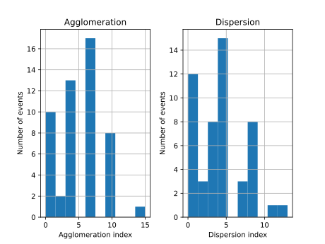
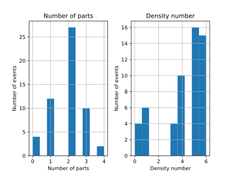

Stats
=====

The Stats command plots both histograms and prints statistical summaries. It processes agglomeration and dispersion indexes and the number of parts and density-number of a given JSON data file.

.. code-block:: console

    rpscripts stats score.json

Command's output:

.. code-block:: console

    Statistical summary: full
        Agglomeration  Dispersion
    count          55.00       55.00
    mean            4.47        3.84
    std             3.56        3.39
    min             0.00        0.00
    25%             1.50        0.00
    50%             3.00        4.00
    75%             6.00        5.00
    max            15.00       13.00

        Number of parts  Density number
    count            55.00           55.00
    mean              1.89            4.15
    std               0.92            1.91
    min               0.00            0.00
    25%               1.00            3.50
    50%               2.00            5.00
    75%               2.00            6.00
    max               4.00            6.00

    Agglomeration and dispersion indexes histograms

    Number of parts and density-number histograms
