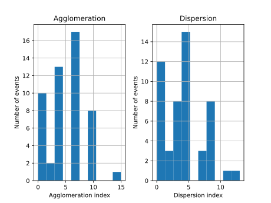

Stats
=====

Stats command plots agglomeration and dispersion indexes histograms and prints statistical summary about the given JSON data.

.. code-block:: console

    rpscripts stats score.json

Command's output:

.. code-block:: console

    Statistical summary: full
        Agglomeration  Dispersion
    count          55.00       55.00
    mean            4.47        3.84
    std             3.56        3.39
    min             0.00        0.00
    25%             1.50        0.00
    50%             3.00        4.00
    75%             6.00        5.00
    max            15.00       13.00

    Histograms
