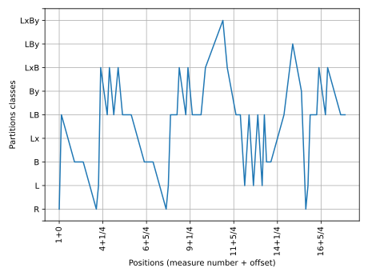
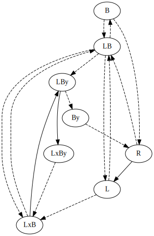
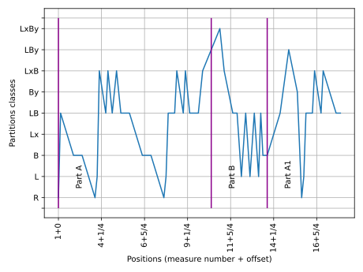
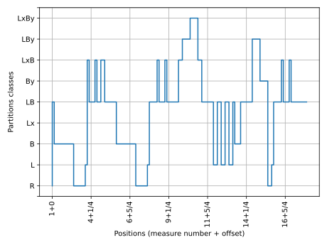
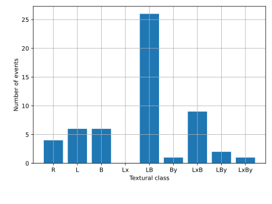
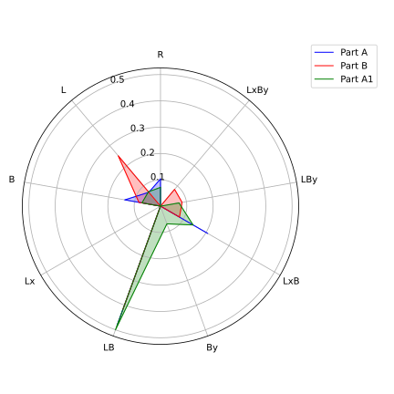

TClass
======

TClass calculates the textural classes and returns two charts: textural classes in time and textural classes graph, both from a given JSON file generated by :doc:`calculator`. This command generates basic charts:

.. code-block:: console

    rpscripts tclass score.json

**Note**: See `Moreira, 2019` at :doc:`../bibliography` for further information about textural classes.

**Note**: All the examples below are from Robert Schumann's op. 48, n. 2 (See the `examples <https://github.com/msampaio/rpScripts/tree/main/examples>`_ folder).

    Textural classes in time

    Textural classes graph. Solid lines represents steps, and dashed lines, skips.

TClass calculates the textural classes of a given JSON file and saves them in the same file.

See :doc:`annotator` documentation for textural classes annotation on digital score files.

TClass accepts multiple options to omit charts and to show form labels.

The option ``-h`` prints the command help:

.. code-block:: console

    usage: rpscripts tclass [-h] [-np] [-ng] [-fl] [-s] [-c] [-r] filename

    positional arguments:
    filename              JSON filename (calc's output)

    options:
    -h, --help            show this help message and exit
    -np, --no_plot        No textural class chart
    -ng, --no_graph       No graph chart
    -fl, --show_form_labels
                            Draw vertical lines to display given form labels. It demands a previous labeled file. Check rpscripts labels -h' column
    -s, --as_step         Step chart
    -c, --counting_chart  Counting chart
    -r, --radar_chart     Radar chart

Omit textural classes chart generation
--------------------------------------

Use the ``-np`` option to omit textural classes in time chart generation.

.. code-block:: console

    rpscripts tclass -np score.json

Omit textural classes graph generation
--------------------------------------

Use the ``-ng`` option to omit textural classes graph generation.

.. code-block:: console

    rpscripts tclass -ng score.json

Form labels displaying
----------------------

For the labels displaying, use the ``-fl`` option. It adds vertical lines in the textural classes chart. It demands a labeled ``JSON`` file. The :doc:`labeler` program generates the labeled file.

.. code-block:: console

    rpscripts tclass -fl score.json

    Textural classes chart with form labels indications

Step style
----------

Use the ``-s`` option to plot textural classes in time in step style:

.. code-block:: console

    rpscripts tclass -s score.json

    Textural classes chart in step style

Counting chart
--------------

Use the ``-c`` option to plot a textural classes counting chart.

.. code-block:: console

    rpscripts tclass -c score.json

    Textural classes counting chart

Radar chart
-----------

Use the ``-r`` option to plot a radar chart.

.. code-block:: console

    rpscripts tclass -r score.json

    Textural classes radar chart