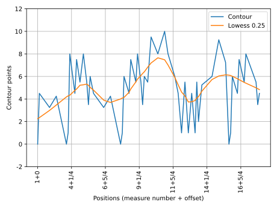
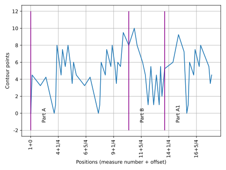

TContour
========

TContour calculates the textural complexity and returns a chart with the textural complexity in time from a given JSON file generated by :doc:`calculator`. This command generates the basic complexity chart:

.. code-block:: console

    rpscripts tcontour score.json

**Note**: See `Moreira, 2015` and `Moreira, 2019` at :doc:`../bibliography` for further information about textural complexity.

**Note**: All the examples below are from Robert Schumann's op. 48, n. 2 (See the `examples <https://github.com/msampaio/rpScripts/tree/main/examples>`_ folder).

.. figure:: ../../../examples/schumann-opus48no2-complexity.svg
    :alt: textural-complexity-time

    Textural complexity in time

TContour calculates the textural complexity of a given JSON file and saves them in the same file.

See :doc:`annotator` documentation for textural complexity annotation on digital score files.

TContour accepts multiple options to omit charts and to show form labels.

The option ``-h`` prints the command help:

.. code-block:: console

    usage: rpscripts tcontour [-h] [-fl] [-np] [-o]
                            [--lowess_degree LOWESS_DEGREE] [-s]
                            filename

    positional arguments:
    filename              JSON filename (calc's output)

    options:
    -h, --help            show this help message and exit
    -fl, --show_form_labels
                            Draw vertical lines to display given form labels. It
                            demands a previous labeled file. Check rpscripts
                            labels -h' column
    -np, --no_plot        No Plot chart
    -o, --lowess          Plot LOWESS
    --lowess_degree LOWESS_DEGREE
                            Lowess degree
    -s, --as_step         Step chart

Omit textural complexity chart generation
-----------------------------------------

Use the ``-np`` option to omit the of the textural complexity in time chart.

.. code-block:: console

    rpscripts tcontour -np score.json

LOWESS
------

Use the ``-o`` option to add the locally weighted scatterplot smoothing (LOWESS) to the complexity chart.

.. code-block:: console

    rpscripts tcontour -o score.json

Use the ``--lowess_degree`` option to set up the LOWESS degree. The default value is 0.05.

.. code-block:: console

    rpscripts tcontour -o --lowess_degree 0.25 score.json

    Textural complexity with LOWESS

**Note**: See `Cleveland, 1979` and `Cleveland, 1981` at :doc:`../bibliography` for further information about LOWESS.

Form labels displaying
----------------------

For the labels displaying, use the ``-fl`` option. It adds vertical lines in the complexity chart. It demands a labeled ``JSON`` file. The :doc:`labeler` program generates the labeled file.

.. code-block:: console

    rpscripts tcontour -fl score.json

    Textural complexity with form labels indications

Step style
----------

Use the ``-s`` option to plot textural complexity in step style:

.. code-block:: console

    rpscripts tcontour -s score.json

    Textural complexity as step chart